# Hackintosh Catalina Installation Guide for ASUS ROG STRIX Z390-I GAMING Motherboard

Perfect Vanilla Hackintosh with OpenCore bootloader like real mac.

OpenCore supports boot hotkeys, hold Option or ESC at startup to choose a boot device, Command+R to enter Recovery or Command+Option+P+R to reset NVRAM.

I used this guides as starting point:

https://github.com/khronokernel/Opencore-Vanilla-Desktop-Guide

https://github.com/acidanthera/OpenCorePkg/blob/master/Docs/Configuration.pdf

## Hardware

- Gigabyte ASUS ROG STRIX Z390-I GAMING
- Intel Core i5-8500T
- 2 x Kingston HyperX Predator 8GB DDR4 3000MHz
- 1 x SAPPHIRE PULSE Radeon RX 570 ITX 4GB
- 1 x Samsung SSD 850 EVO 250GB
- 1 x Broadcom BCM94350ZAE/DW1820A M.2 WiFi/ac and BT4LE (replaced on the motherboard)
  - BCM4350 cards proved unreliable in terms of usage. Only some models work properly
  - BCM94352Z/DW1560 is better

## What works

- Sleep / Wake
- Power Nap (sleep with background operations such as Time Machine)
- Audio (select internal speakers)
- Ethernet
- Bluetooth (lag when Wi-Fi is on)
- Wi-Fi
- 15 USB port

## My Workstation

<details>


</details>

## macOS System Information

<details>

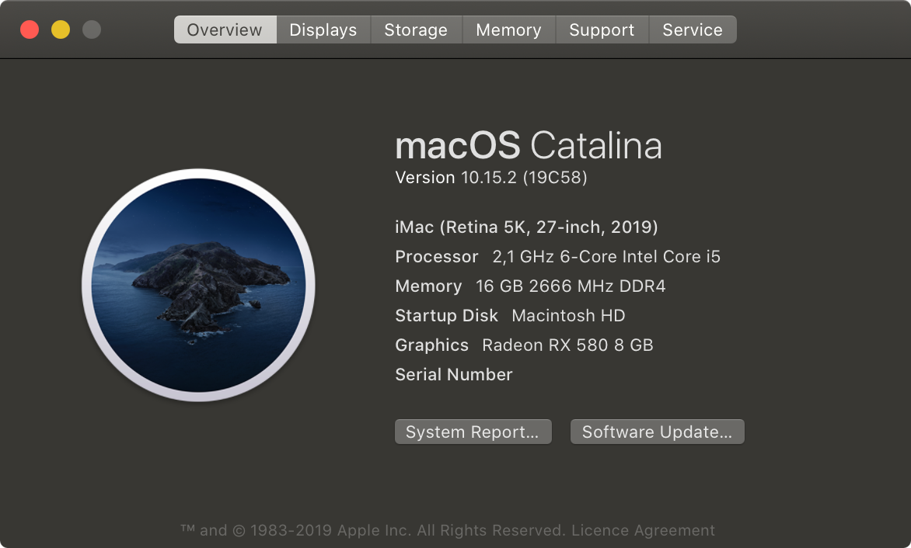

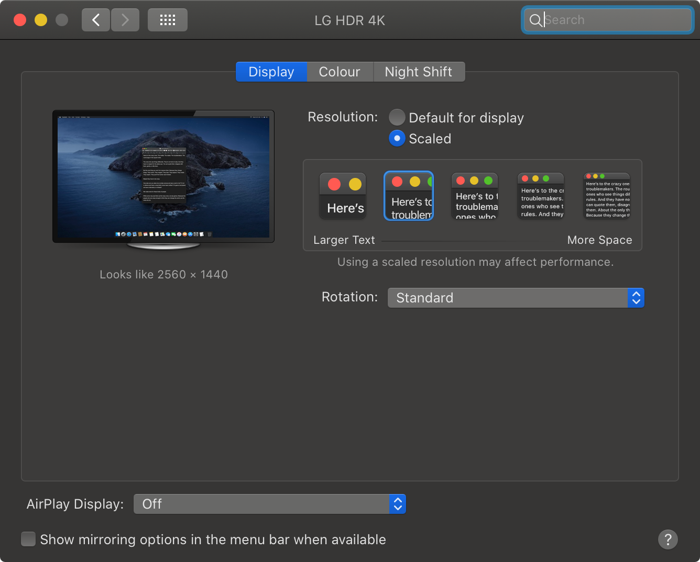
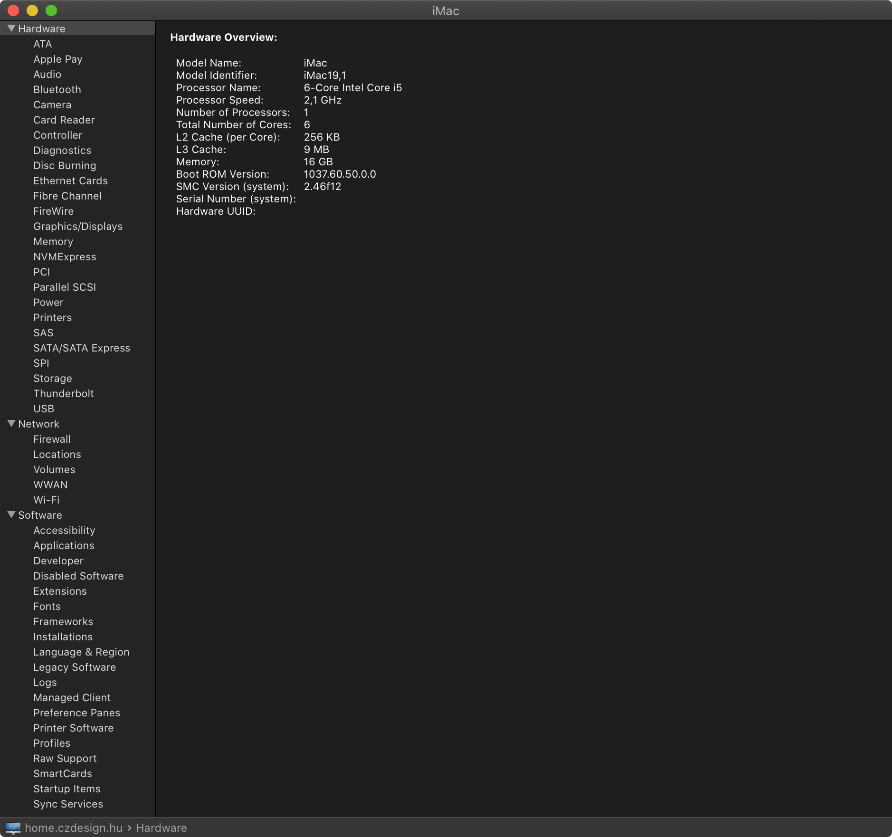
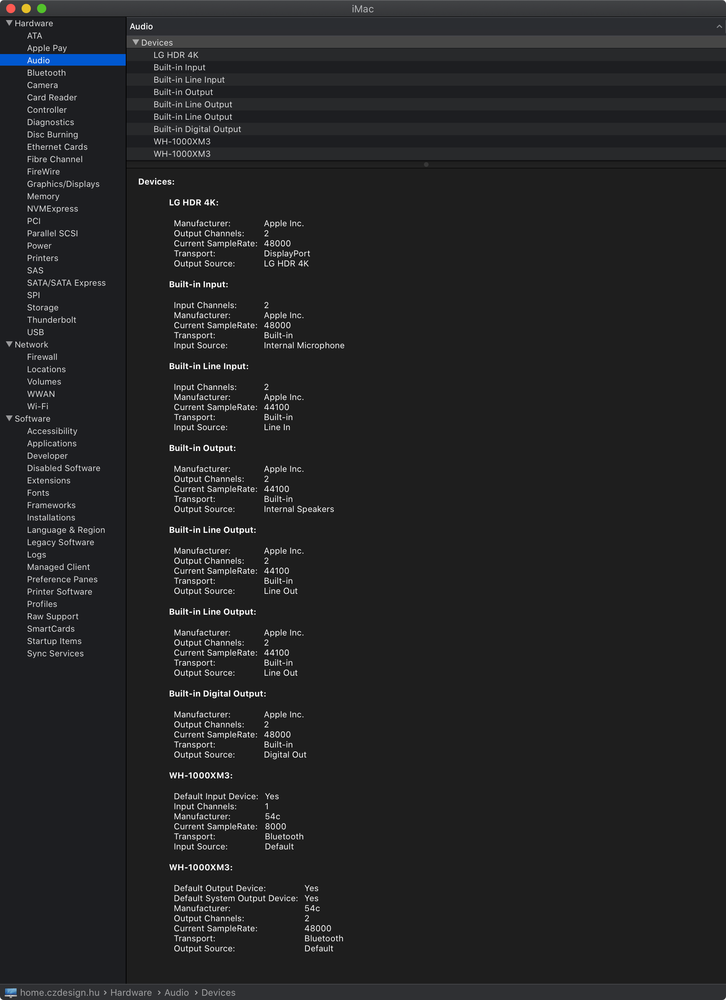


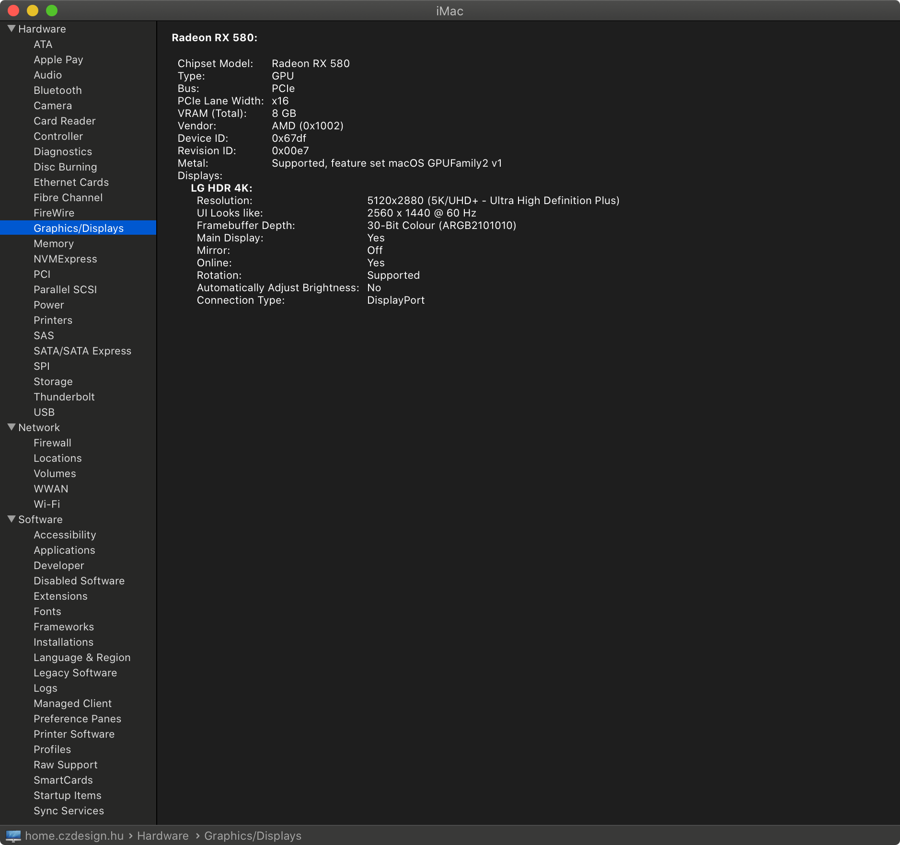
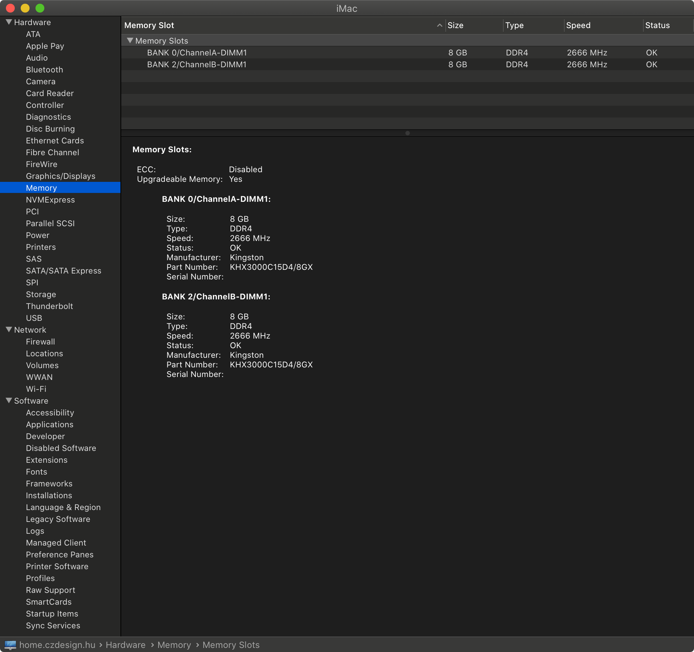


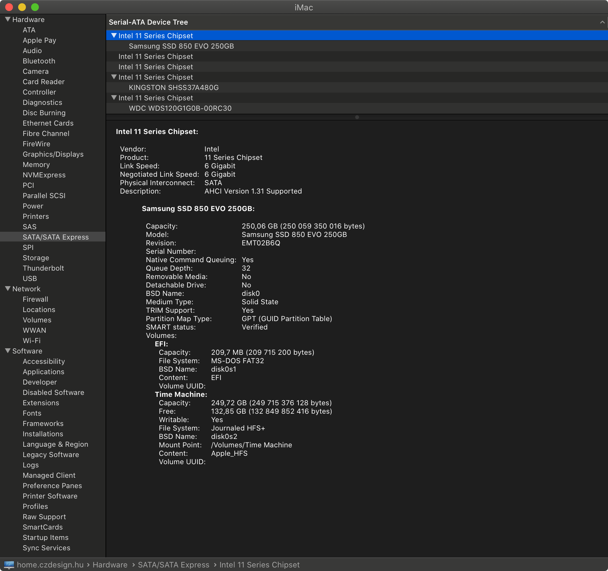


</details>

## Benchmark

<details>

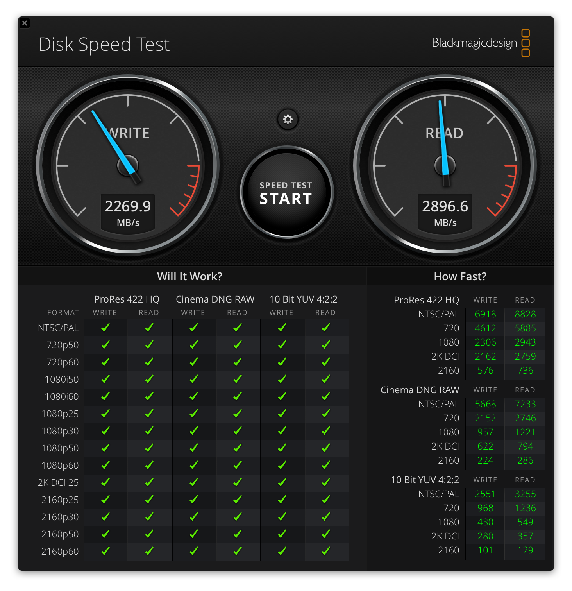

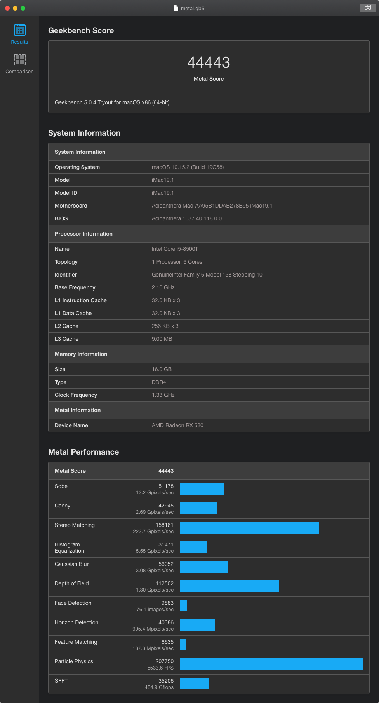
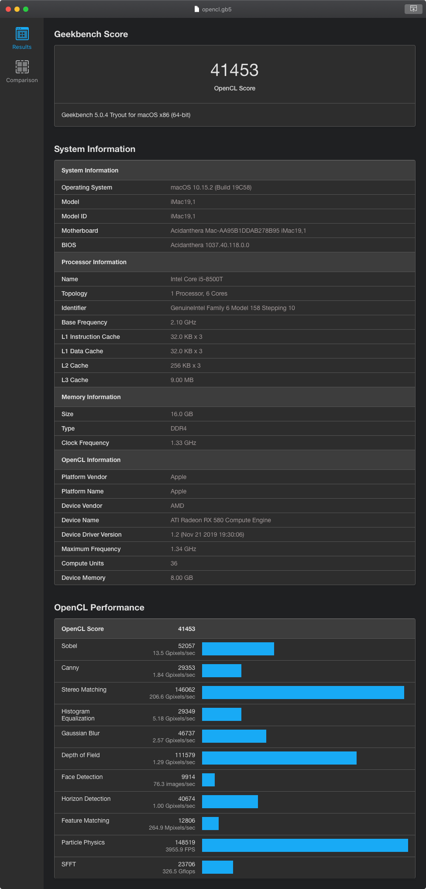
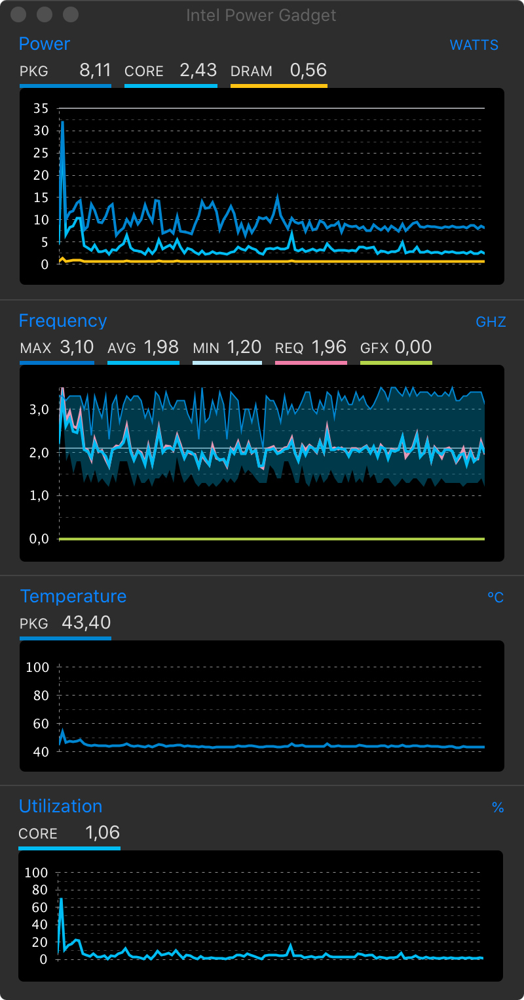
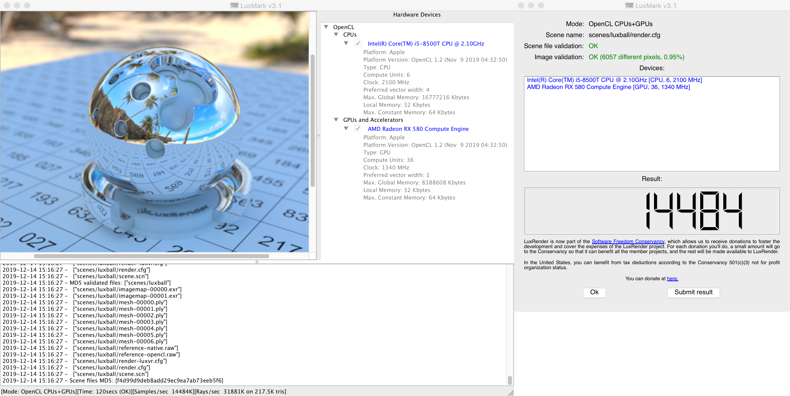

</details>

## USBMap

Selected XHC ports (max 15)

| Ports | Type | Description |
| --- | --- | --- |
| HS02 | USB 2 Type C connector | Rear USB Type-C |
| HS03 | USB 3 Standard-A connector | Rear USB 3.1 Gen 2 (red) |
| HS04 | USB 3 Standard-A connector | Rear USB 3.1 Gen 2 (red) |
| HS05 | USB 2 Type A connector | Rear USB 2.0 (black) |
| HS06 | USB 2 Type A connector | Rear USB 2.0 (black) |
| HS07 | USB 3 Standard-A connector | Rear USB 3.1 Gen 1 (blue) |
| HS08 | USB 3 Standard-A connector | Rear USB 3.1 Gen 1 (blue) |
| HS09 | USB 3 Standard-A connector | Front USB 3.1 Gen 1 |
| HS10 | USB 3 Standard-A connector | Front USB 3.1 Gen 1 |
| HS13 | Internal connector | RGB LED Lighting - AURA MOTHERBOARD |
| HS14 | Internal connector | Bluetooth/Wifi - BCM2045A0 |
| SS03 | USB 3 Standard-A connector | Rear USB 3.1 Gen 2 (red) |
| SS04 | USB 3 Standard-A connector | Rear USB 3.1 Gen 2 (red) |
| SS09 | USB 3 Standard-A connector | Front USB 3.1 Gen 1 |
| SS10 | USB 3 Standard-A connector | Front USB 3.1 Gen 1 |

## BIOS settings

<details>

```
Ai Overclock Tuner [XMP I]
XMP [XMP DDR4-3000 15-17-17-36-1.35V]
BCLK Frequency [102.3000]
ASUS MultiCore Enhancement [Disabled – Enforce All limits]
SVID Behavior [Auto]
CPU Core Ratio [Auto]
DRAM Odd Ratio Mode [Enabled]
DRAM Frequency [DDR4-3000MHz]
Power-saving & Performance Mode [Auto]
CPU SVID Support [Auto]
DRAM CAS# Latency [15]
DRAM RAS# to CAS# Delay [17]
DRAM RAS# ACT Time [36]
DRAM Command Rate [Auto]
DRAM RAS# to RAS# Delay L [Auto]
DRAM RAS# to RAS# Delay S [Auto]
DRAM REF Cycle Time [Auto]
DRAM REF Cycle Time 2 [Auto]
DRAM REF Cycle Time 4 [Auto]
DRAM Refresh Interval [Auto]
DRAM WRITE Recovery Time [Auto]
DRAM READ to PRE Time [Auto]
DRAM FOUR ACT WIN Time [Auto]
DRAM WRITE to READ Delay [Auto]
DRAM WRITE to READ Delay L [Auto]
DRAM WRITE to READ Delay S [Auto]
DRAM CKE Minimum Pulse Width [Auto]
DRAM Write Latency [Auto]
ODT RTT WR (CHA) [Auto]
ODT RTT PARK (CHA) [Auto]
ODT RTT NOM (CHA) [Auto]
ODT RTT WR (CHB) [Auto]
ODT RTT PARK (CHB) [Auto]
ODT RTT NOM (CHB) [Auto]
ODT_READ_DURATION [Auto]
ODT_READ_DELAY [Auto]
ODT_WRITE_DURATION [Auto]
ODT_WRITE_DELAY [Auto]
Data Rising Slope [Auto]
Data Rising Slope Offset [Auto]
Cmd Rising Slope [Auto]
Cmd Rising Slope Offset [Auto]
Ctl Rising Slope [Auto]
Ctl Rising Slope Offset [Auto]
Clk Rising Slope [Auto]
Clk Rising Slope Offset [Auto]
Data Falling Slope [Auto]
Data Falling Slope Offset [Auto]
Cmd Falling Slope [Auto]
Cmd Falling Slope Offset [Auto]
Ctl Falling Slope [Auto]
Ctl Falling Slope Offset [Auto]
Clk Falling Slope [Auto]
Clk Falling Slope Offset [Auto]
DRAM RTL INIT value [Auto]
DRAM RTL (CHA DIMM0 Rank0) [Auto]
DRAM RTL (CHA DIMM0 Rank1) [Auto]
DRAM RTL (CHA DIMM1 Rank0) [Auto]
DRAM RTL (CHA DIMM1 Rank1) [Auto]
DRAM RTL (CHB DIMM0 Rank0) [Auto]
DRAM RTL (CHB DIMM0 Rank1) [Auto]
DRAM RTL (CHB DIMM1 Rank0) [Auto]
DRAM RTL (CHB DIMM1 Rank1) [Auto]
DRAM IOL (CHA DIMM0 Rank0) [Auto]
DRAM IOL (CHA DIMM0 Rank1) [Auto]
DRAM IOL (CHA DIMM1 Rank0) [Auto]
DRAM IOL (CHA DIMM1 Rank1) [Auto]
DRAM IOL (CHB DIMM0 Rank0) [Auto]
DRAM IOL (CHB DIMM0 Rank1) [Auto]
DRAM IOL (CHB DIMM1 Rank0) [Auto]
DRAM IOL (CHB DIMM1 Rank1) [Auto]
CHA IO_Latency_offset [Auto]
CHB IO_Latency_offset [Auto]
CHA RFR delay [Auto]
CHB RFR delay [Auto]
Early Command Training [Enabled]
SenseAmp Offset Training [Enabled]
Early ReadMPR Timing Centering 2D [Enabled]
Read MPR Training [Enabled]
Receive Enable Training [Enabled]
Jedec Write Leveling [Enabled]
Early Write Time Centering 2D [Enabled]
Early Read Time Centering 2D [Auto]
Write Timing Centering 1D [Enabled]
Write Voltage Centering 1D [Enabled]
Read Timing Centering 1D [Enabled]
Dimm ODT Training* [Auto]
Max RTT_WR [ODT Off]
DIMM RON Training* [Auto]
Write Drive Strength/Equalization 2D* [Disabled]
Write Slew Rate Training* [Enabled]
Read ODT Training* [Enabled]
Read Equalization Training* [Enabled]
Read Amplifier Training* [Enabled]
Write Timing Centering 2D [Enabled]
Read Timing Centering 2D [Enabled]
Command Voltage Centering [Enabled]
Write Voltage Centering 2D [Enabled]
Read Voltage Centering 2D [Auto]
Late Command Training [Auto]
Round Trip Latency [Auto]
Turn Around Timing Training [Disabled]
Rank Margin Tool [Disabled]
Memory Test [Disabled]
DIMM SPD Alias Test [Enabled]
Receive Enable Centering 1D [Enabled]
Retrain Margin Check [Disabled]
Write Drive Strength Up/Dn independently [Disabled]
tRDRD_sg [Auto]
tRDRD_dg [Auto]
tRDWR_sg [Auto]
tRDWR_dg [Auto]
tWRWR_sg [Auto]
tWRWR_dg [Auto]
tWRRD_sg [Auto]
tWRRD_dg [Auto]
tRDRD_dr [Auto]
tRDRD_dd [Auto]
tRDWR_dr [Auto]
tRDWR_dd [Auto]
tWRWR_dr [Auto]
tWRWR_dd [Auto]
tWRRD_dr [Auto]
tWRRD_dd [Auto]
TWRPRE [Auto]
TRDPRE [Auto]
tREFIX9 [Auto]
OREF_RI [Auto]
MRC Fast Boot [Auto]
DRAM CLK Period [Auto]
Memory Scrambler [Enabled]
Channel A DIMM Control [Enable both DIMMs]
Channel B DIMM Control [Enable both DIMMs]
MCH Full Check [Auto]
Training Profile [Auto]
DLLBwEn [Auto]
SPD Write Disable [TRUE]
CPU Load-line Calibration [Auto]
Synch ACDC Loadline with VRM Loadline [Disabled]
CPU Current Capability [Auto]
CPU VRM Switching Frequency [Auto]
VRM Spread Spectrum [Auto]
CPU Power Duty Control [T.Probe]
CPU Power Phase Control [Auto]
CPU VRM Thermal Control [Auto]
CPU Graphics Load-line Calibration [Auto]
CPU Graphics Current Capability [Auto]
CPU Graphics VRM Switching Frequency [Auto]
CPU Graphics Power Phase Control [Auto]
Intel(R) SpeedStep(tm) [Enabled]
Turbo Mode [Enabled]
Long Duration Package Power Limit [Auto]
Package Power Time Window [Auto]
Short Duration Package Power Limit [Auto]
IA AC Load Line [Auto]
IA DC Load Line [Auto]
TVB Voltage Optimizations [Auto]
Realtime Memory Timing [Disabled]
FCLK Frequency for Early Power On [Auto]
BCLK Amplitude [Auto]
BCLK Spread Spectrum [Auto]
BCLK Frequency Slew Rate [Auto]
DRAM VTT Voltage [Auto]
VPPDDR Voltage [Auto]
DMI Voltage [Auto]
Internal PLL Voltage [Auto]
GT PLL Voltage [Auto]
Ring PLL Voltage [Auto]
System Agent PLL Voltage [Auto]
Memory Controller PLL Voltage [Auto]
CPU Core/Cache Current Limit Max. [Auto]
CPU Graphics Current Limit [Auto]
Min. CPU Cache Ratio [32]
Max CPU Cache Ratio [32]
Max. CPU Graphics Ratio [Auto]
CPU Core/Cache Voltage [Auto]
DRAM Voltage [1.35000]
CPU VCCIO Voltage [Auto]
CPU System Agent Voltage [Auto]
CPU Graphics Voltage Mode [Auto]
PCH Core Voltage [Auto]
CPU Standby Voltage [Auto]
DRAM CTRL REF Voltage [Auto]
DRAM DATA REF Voltage on CHB [Auto]
DRAM DATA REF Voltage on CHA DIMM0 Rank0 BL0 [Auto]
DRAM DATA REF Voltage on CHA DIMM0 Rank0 BL1 [Auto]
DRAM DATA REF Voltage on CHA DIMM0 Rank0 BL2 [Auto]
DRAM DATA REF Voltage on CHA DIMM0 Rank0 BL3 [Auto]
DRAM DATA REF Voltage on CHA DIMM0 Rank0 BL4 [Auto]
DRAM DATA REF Voltage on CHA DIMM0 Rank0 BL5 [Auto]
DRAM DATA REF Voltage on CHA DIMM0 Rank0 BL6 [Auto]
DRAM DATA REF Voltage on CHA DIMM0 Rank0 BL7 [Auto]
DRAM DATA REF Voltage on CHA DIMM0 Rank1 BL0 [Auto]
DRAM DATA REF Voltage on CHA DIMM0 Rank1 BL1 [Auto]
DRAM DATA REF Voltage on CHA DIMM0 Rank1 BL2 [Auto]
DRAM DATA REF Voltage on CHA DIMM0 Rank1 BL3 [Auto]
DRAM DATA REF Voltage on CHA DIMM0 Rank1 BL4 [Auto]
DRAM DATA REF Voltage on CHA DIMM0 Rank1 BL5 [Auto]
DRAM DATA REF Voltage on CHA DIMM0 Rank1 BL6 [Auto]
DRAM DATA REF Voltage on CHA DIMM0 Rank1 BL7 [Auto]
DRAM DATA REF Voltage on CHA DIMM1 Rank0 BL0 [Auto]
DRAM DATA REF Voltage on CHA DIMM1 Rank0 BL1 [Auto]
DRAM DATA REF Voltage on CHA DIMM1 Rank0 BL2 [Auto]
DRAM DATA REF Voltage on CHA DIMM1 Rank0 BL3 [Auto]
DRAM DATA REF Voltage on CHA DIMM1 Rank0 BL4 [Auto]
DRAM DATA REF Voltage on CHA DIMM1 Rank0 BL5 [Auto]
DRAM DATA REF Voltage on CHA DIMM1 Rank0 BL6 [Auto]
DRAM DATA REF Voltage on CHA DIMM1 Rank0 BL7 [Auto]
DRAM DATA REF Voltage on CHA DIMM1 Rank1 BL0 [Auto]
DRAM DATA REF Voltage on CHA DIMM1 Rank1 BL1 [Auto]
DRAM DATA REF Voltage on CHA DIMM1 Rank1 BL2 [Auto]
DRAM DATA REF Voltage on CHA DIMM1 Rank1 BL3 [Auto]
DRAM DATA REF Voltage on CHA DIMM1 Rank1 BL4 [Auto]
DRAM DATA REF Voltage on CHA DIMM1 Rank1 BL5 [Auto]
DRAM DATA REF Voltage on CHA DIMM1 Rank1 BL6 [Auto]
DRAM DATA REF Voltage on CHA DIMM1 Rank1 BL7 [Auto]
DRAM DATA REF Voltage on CHB DIMM0 Rank0 BL0 [Auto]
DRAM DATA REF Voltage on CHB DIMM0 Rank0 BL1 [Auto]
DRAM DATA REF Voltage on CHB DIMM0 Rank0 BL2 [Auto]
DRAM DATA REF Voltage on CHB DIMM0 Rank0 BL3 [Auto]
DRAM DATA REF Voltage on CHB DIMM0 Rank0 BL4 [Auto]
DRAM DATA REF Voltage on CHB DIMM0 Rank0 BL5 [Auto]
DRAM DATA REF Voltage on CHB DIMM0 Rank0 BL6 [Auto]
DRAM DATA REF Voltage on CHB DIMM0 Rank0 BL7 [Auto]
DRAM DATA REF Voltage on CHB DIMM0 Rank1 BL0 [Auto]
DRAM DATA REF Voltage on CHB DIMM0 Rank1 BL1 [Auto]
DRAM DATA REF Voltage on CHB DIMM0 Rank1 BL2 [Auto]
DRAM DATA REF Voltage on CHB DIMM0 Rank1 BL3 [Auto]
DRAM DATA REF Voltage on CHB DIMM0 Rank1 BL4 [Auto]
DRAM DATA REF Voltage on CHB DIMM0 Rank1 BL5 [Auto]
DRAM DATA REF Voltage on CHB DIMM0 Rank1 BL6 [Auto]
DRAM DATA REF Voltage on CHB DIMM0 Rank1 BL7 [Auto]
DRAM DATA REF Voltage on CHB DIMM1 Rank0 BL0 [Auto]
DRAM DATA REF Voltage on CHB DIMM1 Rank0 BL1 [Auto]
DRAM DATA REF Voltage on CHB DIMM1 Rank0 BL2 [Auto]
DRAM DATA REF Voltage on CHB DIMM1 Rank0 BL3 [Auto]
DRAM DATA REF Voltage on CHB DIMM1 Rank0 BL4 [Auto]
DRAM DATA REF Voltage on CHB DIMM1 Rank0 BL5 [Auto]
DRAM DATA REF Voltage on CHB DIMM1 Rank0 BL6 [Auto]
DRAM DATA REF Voltage on CHB DIMM1 Rank0 BL7 [Auto]
DRAM DATA REF Voltage on CHB DIMM1 Rank1 BL0 [Auto]
DRAM DATA REF Voltage on CHB DIMM1 Rank1 BL1 [Auto]
DRAM DATA REF Voltage on CHB DIMM1 Rank1 BL2 [Auto]
DRAM DATA REF Voltage on CHB DIMM1 Rank1 BL3 [Auto]
DRAM DATA REF Voltage on CHB DIMM1 Rank1 BL4 [Auto]
DRAM DATA REF Voltage on CHB DIMM1 Rank1 BL5 [Auto]
DRAM DATA REF Voltage on CHB DIMM1 Rank1 BL6 [Auto]
DRAM DATA REF Voltage on CHB DIMM1 Rank1 BL7 [Auto]
PCI Express Native Power Management [Disabled]
PCH DMI ASPM [Disabled]
ASPM [Disabled]
L1 Substates [Disabled]
PCI Express Clock Gating [Enabled]
DMI Link ASPM Control [Disabled]
PEG - ASPM [Disabled]
Software Guard Extensions (SGX) [Disabled]
Tcc Offset Time Window [Auto]
Hardware Prefetcher [Enabled]
Adjacent Cache Line Prefetch [Enabled]
Intel (VMX) Virtualization Technology [Enabled]
Active Processor Cores [All]
Thermal Monitor [Enabled]
Intel(R) SpeedStep(tm) [Enabled]
Intel(R) Speed Shift Technology [Enabled]
Turbo Mode [Enabled]
CPU C-states [Auto]
CFG Lock [Disabled]
VT-d [Enabled]
Above 4G Decoding [Enabled]
Memory Remap [Enabled]
Primary Display [PEG]
iGPU Multi-Monitor [Enabled]
DVMT Pre-Allocated [32M]
RC6(Render Standby) [Auto]
PCIEX16 Link Speed [Auto]
PCIe Speed [Auto]
IOAPIC 24-119 Entries [Enabled]
SATA Controller(s) [Enabled]
SATA Mode Selection [AHCI]
Aggressive LPM Support [Disabled]
SMART Self Test [Enabled]
SATA6G_1(Black) [Enabled]
SATA6G_1 Hot Plug [Disabled]
SATA6G_2(Black) [Enabled]
SATA6G_2 Hot Plug [Disabled]
SATA6G_3(Black) [Enabled]
SATA6G_3 Hot Plug [Disabled]
SATA6G_4(Black) [Enabled]
SATA6G_4 Hot Plug [Disabled]
M.2_2 [Enabled]
Intel Platform Trust Technology [Disabled]
Hyper M.2X16 [Disabled]
HD Audio [Enabled]
Intel LAN Controller [Enabled]
Intel PXE Option ROM [Disabled]
When system is in working state [On]
When system is in sleep, hibernate or soft off states [Off]
USB power delivery in Soft Off state (S5) [Enabled]
Wi-Fi Controller [Enabled]
Bluetooth Controller [Enabled]
ErP Ready [Disabled]
CEC Ready [Disabled]
Restore AC Power Loss [Power Off]
Power On By PCI-E [Disabled]
Power On By RTC [Disabled]
SR-IOV Support [Disabled]
Legacy USB Support [Disabled]
XHCI Hand-off [Enabled]
U31G2_3 [Enabled]
U31G2_4 [Enabled]
USB_5 [Enabled]
USB_6 [Enabled]
U31G1_7 [Enabled]
U31G1_8 [Enabled]
U31G1_9 [Enabled]
U31G1_10 [Enabled]
USB_11 [Enabled]
USB_12 [Enabled]
U31G2_C1\U31G1_C5 [Enabled]
Network Stack [Enabled]
Ipv4 PXE Support [Disabled]
Ipv6 PXE Support [Disabled]
Device [Samsung SSD 850 EVO 250GB]
CPU Temperature [Monitor]
MotherBoard Temperature [Monitor]
PCH Temperature [Monitor]
T_Sensor Temperature [Monitor]
CPU Fan Speed [Monitor]
Chassis Fan Speed [Monitor]
AIO PUMP Speed [Monitor]
CPU Core Voltage [Monitor]
CPU Graphics Voltage [Monitor]
3.3V Voltage [Monitor]
5V Voltage [Monitor]
12V Voltage [Monitor]
PCH Core Voltage [Monitor]
CPU System Agent Voltage [Monitor]
CPU VCCIO Voltage [Monitor]
DRAM Voltage [Monitor]
CPU Standby Voltage [Monitor]
CPU Q-Fan Control [Auto]
CPU Fan Step Up [0 sec]
CPU Fan Step Down [0 sec]
CPU Fan Speed Lower Limit [200 RPM]
CPU Fan Profile [Silent]
Chassis Fan Q-Fan Control [Auto]
Chassis Fan Q-Fan Source [MotherBoard]
Chassis Fan Step Up [0 sec]
Chassis Fan Step Down [0 sec]
Chassis Fan Speed Low Limit [200 RPM]
Chassis Fan Profile [Silent]
AIO PUMP Control [Disabled]
CPU Temperature LED Switch [Disabled]
Fast Boot [Disabled]
Boot Logo Display [Auto]
POST Delay Time [0 sec]
Bootup NumLock State [On]
Wait For 'F1' If Error [Enabled]
Option ROM Messages [Force BIOS]
Interrupt 19 Capture [Disabled]
AMI Native NVMe Driver Support [Enabled]
Setup Mode [Advanced Mode]
Launch CSM [Disabled]
OS Type [Windows UEFI mode]
Load from Profile [1]
Profile Name [macOS]
Save to Profile [1]
DIMM Slot Number [DIMM_A1]
Bus Interface [PCIEX16]
Download & Install ARMOURY CRATE app [Disabled]

```

</details>

<space><space>

<details>
<summary>Screenshots</summary>


</details>